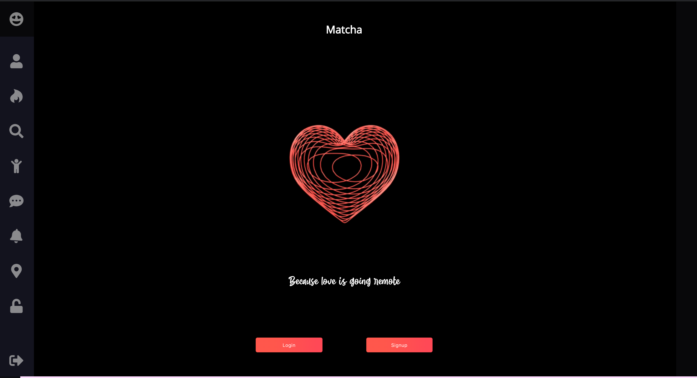
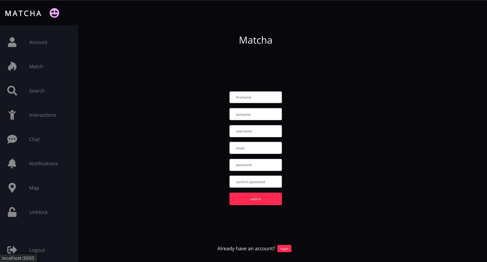
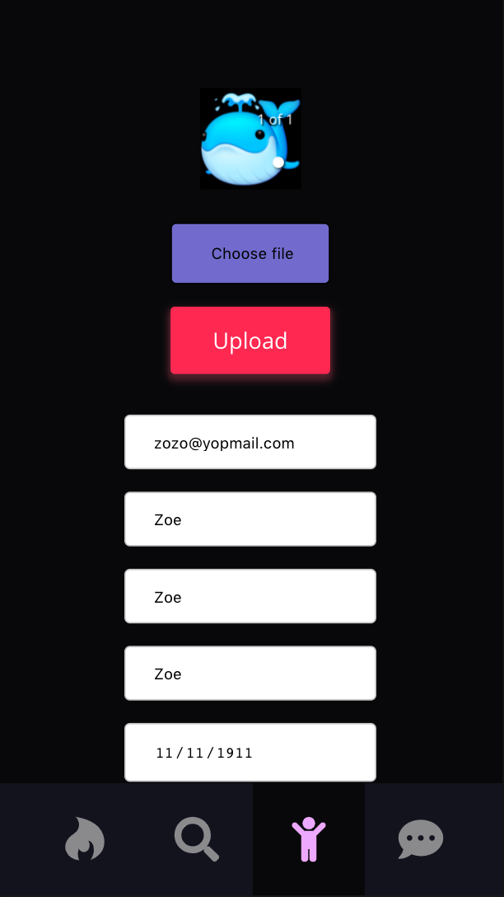
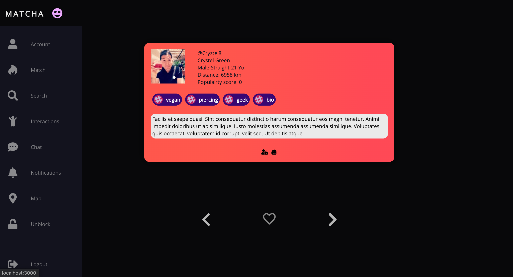
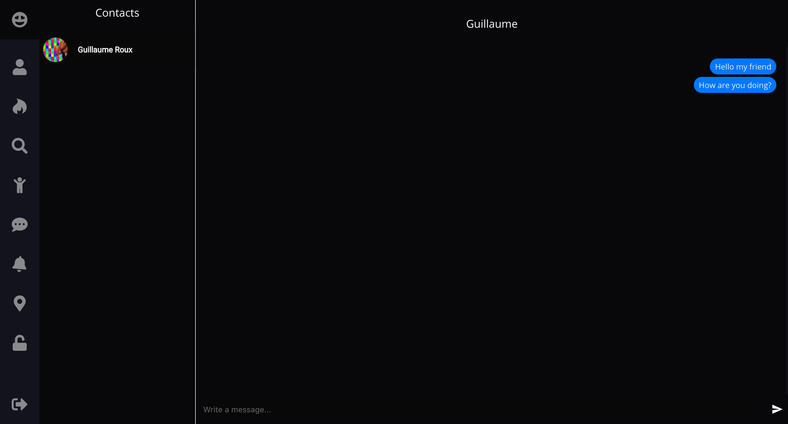
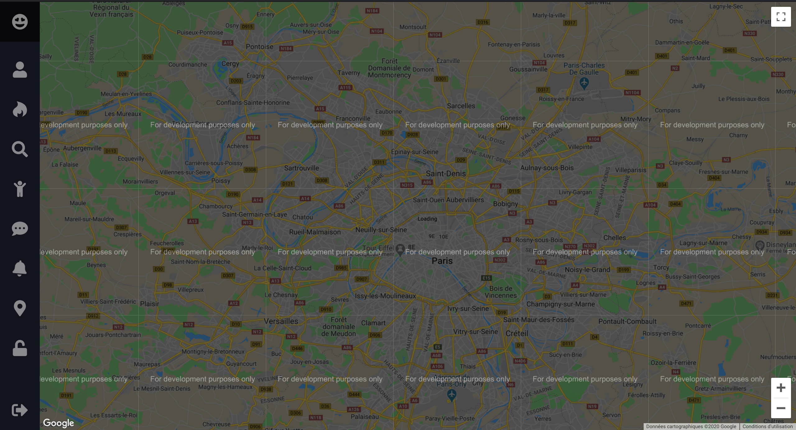

# Matcha

Matcha is the second project of the web branch at 42. The goal is to do a dating webapp, we are free to choose the languages / frameworks we want, but many tools are still forbidden (like object-relational mapping).

I was working with a friend on this project. We both wanted to learn something new so I went for React (as he already was comfortable with it) and he went for Neo4j, a graph oriented database.


## Starting the project

From your terminal run these commands

```
git clone https://github.com/nicovrg/matcha.git
cd matcha/front
yarn start
```

It should open a new tab in your browser with localhost/3000 in the url
If it does not open in your browser you can do it manually (it could be some other port if 3000 is already used)

## Front

I've work on all the frontend, except for the socket related stuff (chat and notifications).
As it was my first project with this technology, I did things in a way, found a better way later on, then iterate and so on...

React is a very powerful toolkit, yet a bit frustrating.
You're never really sure what's happening under the hood so it's hard to know if your solution is elegant or trash.
I've used some of its hooks (mainly state, effect, context, custom).

I also iterate a lot on styling. I've started with css files, then added material-ui style librairy, then removed it and went with style-components and vanilla css. The app is responsive. You can find some screenshots of the app running at the end of this Readme

## Back









